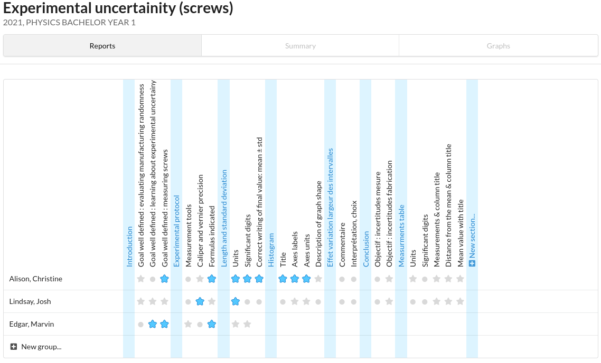

# A *Rubrics* tool for teachers

A work-in-progress tool intended for teachers that like to grade assignments with [*Rubrics*](https://en.wikipedia.org/wiki/Rubric_(academic)):

> (Wikipedia) In US education terminology, rubric is "a scoring guide used to evaluate the quality of students' constructed responses". Put simply, it is a set of criteria for grading assignments. Rubrics usually contain evaluative criteria, quality definitions for those criteria at particular levels of achievement, and a scoring strategy. They are often presented in table format and can be used by teachers when marking, and by students when planning their work.
>
> Several common features of scoring rubrics can be distinguished, according to Bernie Dodge and Nancy Pickett:
> - They focus on measuring a stated objective (performance, behavior, or quality).
> - They use a range to rate performance.
> - They contain specific performance characteristics arranged in levels - indicating either the developmental sophistication of the strategy used or the degree to which a standard has been met.

The project is an interactive website that displays tables for grading exams with rubrics. Student's scores can be modified with simple clicks.

### Project status

This project is work-in-progress, and not ready for daily use. Assignments/exams can be created, students registered and graded, but the overall user experience is not comfortable to work with. There are likely many bugs, and I cannot guarantee the persistence of your data.

Even though the tool relies on a website interface, I do not have a publicly hosted instance (and never will have - the struggle to deal with personal data is too high).

Development is semi-active: I am neither a full time teacher neither a full time programmer, I work on this project in my free time as a PhD student with teaching responsibilities. **Contributions are welcome!**

### Technology stack

The website relies on a [Django](https://www.djangoproject.com/) backend and [HTMX](https://htmx.org/) frontend. The project is contained within two [Docker](https://www.docker.com/) containers (Django server and a [PostgreSQL](https://www.postgresql.org/)  database), managed with [docker-compose](https://docs.docker.com/compose/).

## How to test

You can easily test the website, by hosting it locally on your machine: any operating system should do. The only requirements are [Docker](https://www.docker.com/) and [docker-compose](https://docs.docker.com/compose/). Once you have downloaded the files in this repository, this [docker-compose quickstart guide](https://docs.docker.com/samples/django/) is pretty much all you have to follow.
